# MeshAgent

[](https://www.buymeacoffee.com/chaykr)

Web platform สำหรับ orchestrate AI dev team agents — เข้าถึงได้จากทุกที่ผ่าน browser รวมถึง mobile และ iPad

ต่อยอดจาก [agent-teams](https://github.com/itseed/agent-teams) CLI ให้รันบน server แบบ always-on พร้อม Kanban dashboard และ GitHub integration

---

## Architecture

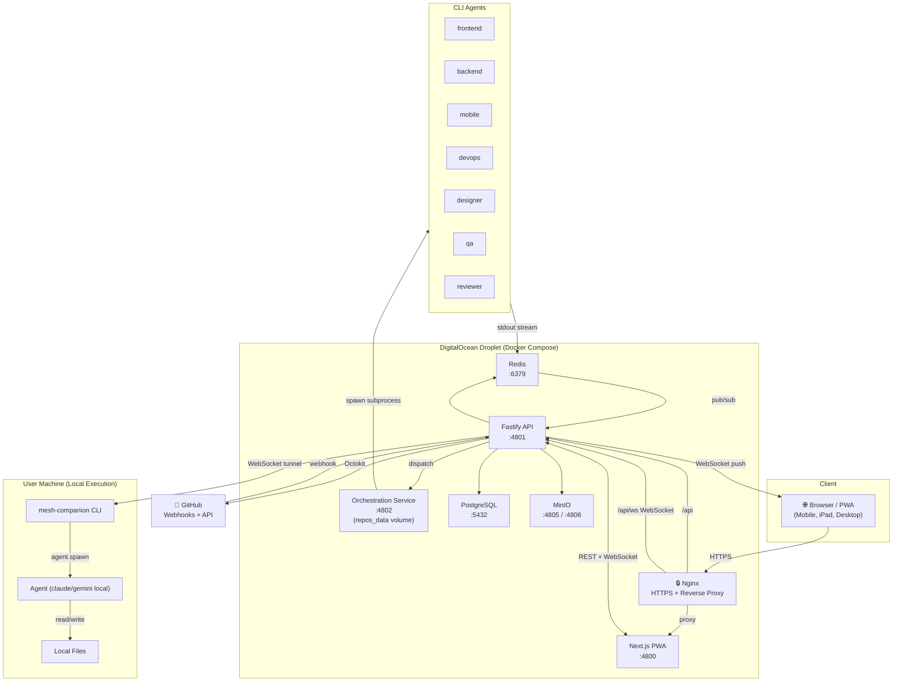

---

## Screenshots

|                                                           |                                                                                                                          |
| --------------------------------------------------------- | ------------------------------------------------------------------------------------------------------------------------ |
| 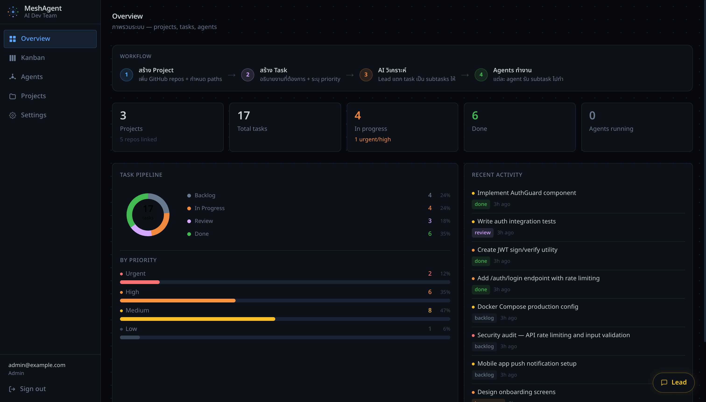                | 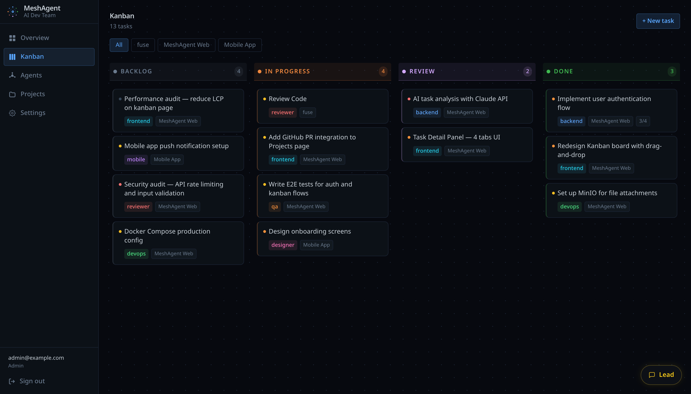                                                                                   |
| **Overview** — ภาพรวม projects, pipeline, recent activity | **Kanban** — Backlog → In Progress → Review → Done พร้อม filter by project                                               |
| 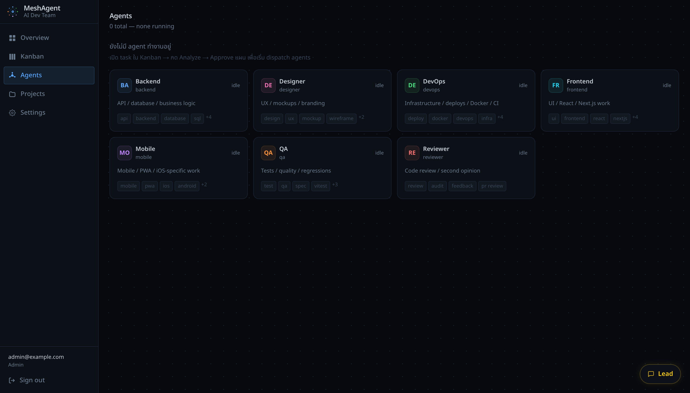                    | 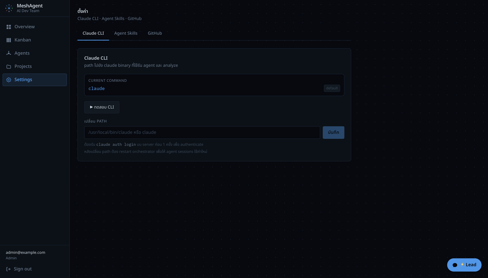                                                                               |
| **Agents** — monitoring ทุก agent role พร้อม live output  | **Settings** — CLI tab (toggle claude/gemini/cursor, login status, test CLI, repos base dir), GitHub OAuth, Agent Skills |

---

## Features

| Feature                    | Description                                                                                                      |
| -------------------------- | ---------------------------------------------------------------------------------------------------------------- |
| **Lead Chat**              | พิมพ์ภาษาธรรมชาติ → Lead AI วิเคราะห์ → propose task brief → confirm → dispatch                                  |
| **Kanban Board**           | Backlog → In Progress → Review → Done พร้อม drag-and-drop และ real-time update ผ่าน WebSocket                    |
| **Agent Monitoring**       | เห็น live output ทุก agent พร้อมกัน real-time                                                                    |
| **Review Loop**            | Reviewer agent วิเคราะห์ → เลือก issue → สร้าง fix task + dispatch อัตโนมัติ                                     |
| **GitHub Integration**     | PRs, commits, issues — agent สร้าง PR ได้โดยตรง                                                                  |
| **Projects**               | จัดการ projects + paths per role ผ่าน UI                                                                         |
| **Multi-user**             | role-based access: admin / member / viewer                                                                       |
| **PWA**                    | ติดตั้งบน iOS/Android ได้                                                                                        |
| **CLI Provider Selection** | เลือก claude / gemini / cursor ต่อ agent session จาก Agents page                                                 |
| **Provider Breakdown**     | Overview page แสดง sessions, success rate, avg duration แยกต่อ CLI provider                                      |
| **Repo Lifecycle**         | Auto clone + git worktree ต่อ task, cleanup หลัง session จบ                                                      |
| **Companion**              | mesh-companion CLI เชื่อม local machine กับ platform ผ่าน WebSocket tunnel — ติดตั้งครั้งเดียว connect ได้ทุกที่ |
| **Local Execution**        | Cloud/Local toggle ใน chat — Local mode: agent รันบนเครื่องของคุณ แก้ไฟล์ local โดยตรง ไม่ต้อง commit/push       |
| **Folder Browser**         | Browse filesystem ผ่าน companion เพื่อ set local project paths แบบ drag & drop                                   |

---

## Tech Stack

| Layer          | Technology                                                                 |
| -------------- | -------------------------------------------------------------------------- |
| Frontend       | Next.js 14, React 18, TypeScript, Tailwind CSS                             |
| Backend        | Fastify 4, Drizzle ORM, PostgreSQL 16                                      |
| Realtime       | WebSocket, Redis pub/sub                                                   |
| Orchestration  | Node.js subprocess, Claude Code CLI / Gemini CLI / Cursor Agent            |
| Storage        | MinIO (S3-compatible)                                                      |
| Companion      | Node.js CLI (mesh-companion), JSON-RPC over WebSocket, child_process.spawn |
| Infrastructure | Docker Compose, Nginx, Let's Encrypt                                       |

---

## Quick Start (Development)

### Prerequisites

- Docker + Docker Compose
- Claude Code CLI (`npm install -g @anthropic-ai/claude-code`) พร้อม login (`claude login`)

### Setup

```bash
# Clone และ run install script
git clone https://github.com/itseed/mesh-agent.git
cd mesh-agent
bash scripts/install.sh
# → กำหนด email + password → build Docker → migrate DB → เสร็จ

# Dev: เปิด http://localhost:4800
```

> install.sh จะถามให้เลือก CLI provider ที่ต้องการใช้ (claude / gemini / cursor) และ login อัตโนมัติในขั้นตอนนั้น

เปิด [http://localhost:4800](http://localhost:4800) แล้ว login ด้วย `AUTH_EMAIL` และ `AUTH_PASSWORD` ที่ตั้งระหว่าง install

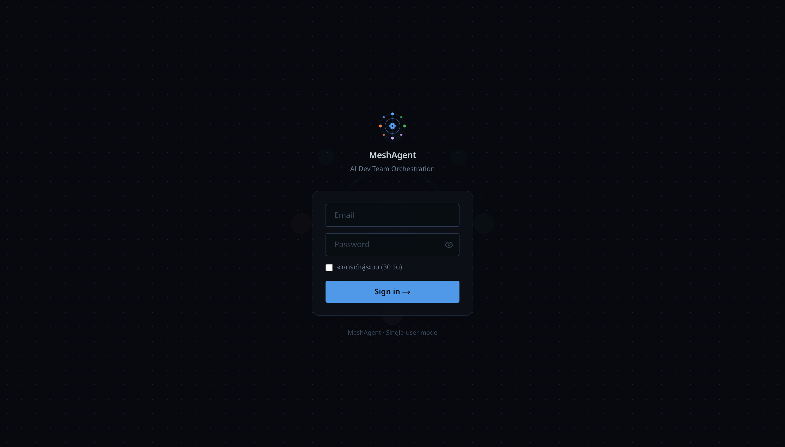

---

## mesh-companion (Local Execution)

mesh-companion คือ CLI ที่รันบนเครื่องของคุณ เชื่อมต่อกับ MeshAgent platform ผ่าน WebSocket tunnel ให้ agent รันโดยตรงบน local machine และ browse filesystem ผ่าน UI

### ติดตั้ง

```bash
npm install -g https://github.com/itseed/mesh-agent/releases/download/v0.1.3/meshagent-companion-0.1.3.tgz
```

### เชื่อมต่อ

1. ไปที่ **Settings → Companion** แล้วกด **Generate Token**
2. Copy token แล้วรัน:

```bash
mesh-companion connect http://localhost:4801 --token <your-token>
```

> Production: เปลี่ยน localhost:4801 เป็น URL ของ server

### ใช้งาน Local Mode

เมื่อ companion connected:

- Chat input จะมี toggle **☁ Cloud / 💻 Local**
- เลือก **Local** → agent spawn บนเครื่องของคุณ แก้ไฟล์ local โดยตรง
- เลือก **Cloud** → agent รันบน server เหมือนเดิม
- ตั้ง **LOCAL PATHS** ใน project settings (via Folder Browser) เพื่อให้แต่ละ role รู้ working directory ที่ถูกต้อง

---

## วิธีใช้งาน

### 1. ตั้งค่า Project

ไปที่ **Projects** แล้วกด **New Project** ระบุ:

- **Project name** — ชื่อ project
- **GitHub Repos** (optional) — repos ที่ agent จะ access ใน Cloud mode
- **Base Branch** — branch ที่ agent จะ fork และ PR เข้า (default: main)
- **LOCAL PATHS** — working directory บนเครื่องของคุณต่อ role (สำหรับ Local mode)

**Cloud mode** ไม่ต้องตั้ง LOCAL PATHS — API ใช้ path จาก GitHub repo clone บน server อัตโนมัติ

**Local mode** ต้องตั้ง LOCAL PATHS ให้ครบทุก role ที่ใช้:

```
LOCAL PATHS:
  frontend  →  /Users/you/project/my-app/web
  backend   →  /Users/you/project/my-app/api
```

ถ้า companion connected จะมีปุ่ม **📁 Open Folder Browser** — ใช้ drag & drop folder จากเครื่องมาวางที่ role row ได้เลย

> Role ที่ไม่มี path จะ fallback ไปใช้ path แรกที่มี

### 2. สั่งงานผ่าน Lead Chat

กดปุ่ม **Lead** (มุมขวาล่าง) แล้วพิมพ์คำสั่งเป็นภาษาธรรมชาติ:

```
"เพิ่ม feature dark mode ใน web app"
"รีวิว code ของ API ให้หน่อย"
"เพิ่ม unit test สำหรับ auth module"
"แก้ bug ที่ login ไม่ redirect หลัง success"
```

Lead AI จะ:

1. วิเคราะห์ request — ถ้าต้องการข้อมูลเพิ่มจะถามก่อน
2. เสนอ **task brief** + role ที่เหมาะสม
3. รอ confirm จากคุณ → กด **ยืนยันและสั่งงาน**

> เลือก project ก่อนพิมพ์ (dropdown ใต้ chat) เพื่อให้ Lead รู้ paths ที่ถูกต้อง

### 2b. เลือก Cloud หรือ Local

ใน chat input มี toggle **☁ Cloud / 💻 Local** (ต้อง companion connected จึงจะเลือก Local ได้):

- **Cloud** — agent รันบน server ใช้ GitHub repo clone (default)
- **Local** — agent spawn บนเครื่องของคุณ แก้ไฟล์ local โดยตรงทันที

ใน **New task** modal ก็มี toggle เดียวกัน ใช้ตั้งค่า default mode ต่อ task

**Agents page** แสดง local sessions ด้วย badge สีเขียว 'local' — กดดูได้เห็น output แบบ polling ทุก 3 วินาที และมีปุ่ม Kill เพื่อหยุดงาน

### 3. ติดตามงานใน Kanban

หลัง confirm งาน — task จะปรากฏใน Kanban **In Progress** ทันที (real-time ผ่าน WebSocket)

เมื่อ agent เสร็จ:

- Task เลื่อนไป **Review** หรือ **Done** อัตโนมัติ
- Lead debrief ผ่าน chat ว่าเสร็จอะไรบ้าง
- มี link **"ดู Task ใน Kanban →"** ใน chat

### 4. Review Loop

ถ้าใช้ role `reviewer`:

1. Reviewer agent วิเคราะห์ code → สร้าง comment พร้อม issues
2. กดปุ่ม **🔧 Fix N Issues** ใน task comment
3. เลือก issue ที่ต้องการแก้ (checklist พร้อม severity badge)
4. กด **Create Fix Tasks** → สร้าง subtask + dispatch fix agent ทันที

### 5. Quick Replies

เมื่อ Lead ถามคำถาม (เช่น "อยากให้ส่ง agent แก้ Critical ทั้ง 7 ก่อนไหมครับ?") — มีปุ่ม quick reply:

- **ใช่ ดำเนินการเลย** — ส่งตอบทันที
- **ยังก่อน** — ปฏิเสธ
- **บอกรายละเอียดเพิ่ม** — ขอข้อมูลเพิ่ม

### 6. หยุด Agent ที่กำลังทำงาน

บน agent message ที่ขึ้นว่า "เริ่มทำงานแล้ว" — กดปุ่ม **■ หยุดงาน** เพื่อ kill session

---

## Agent Roles

| Role         | ทำอะไร                                                   |
| ------------ | -------------------------------------------------------- |
| **frontend** | React, Next.js, TypeScript, CSS, browser extension       |
| **backend**  | REST API, GraphQL, database, business logic, auth        |
| **mobile**   | React Native, iOS/Android native modules                 |
| **devops**   | CI/CD, Docker, deployment, infrastructure, env config    |
| **designer** | Figma-to-code, design system, UX review, accessibility   |
| **qa**       | Unit / integration / e2e tests, edge cases, coverage     |
| **reviewer** | Code review, security audit, performance, best practices |

Lead เลือก role ที่เหมาะสมเองโดยอัตโนมัติ หรือระบุตรงๆ เช่น "ให้ reviewer ตรวจ code"

---

## Environment Variables

| Variable                     | Required | Default                 | Description                                                                  |
| ---------------------------- | -------- | ----------------------- | ---------------------------------------------------------------------------- |
| `DATABASE_URL`               | ✓        | —                       | PostgreSQL connection URL                                                    |
| `DB_POOL_MAX`                | —        | `10`                    | DB connection pool size                                                      |
| `REDIS_URL`                  | ✓        | —                       | Redis connection URL                                                         |
| `AUTH_EMAIL`                 | ✓        | —                       | Initial admin email (seeded on first boot)                                   |
| `AUTH_PASSWORD`              | ✓        | —                       | Initial admin password                                                       |
| `JWT_SECRET`                 | ✓        | —                       | JWT signing secret (32+ chars)                                               |
| `TOKEN_ENCRYPTION_KEY`       | ✓        | —                       | AES-256-GCM key for encrypting GitHub tokens at rest (32 bytes hex)          |
| `CORS_ALLOWED_ORIGINS`       | prod     | —                       | Comma-separated allowed browser origins                                      |
| `COOKIE_DOMAIN`              | —        | —                       | Apex domain for cross-subdomain cookies (e.g. `.yourdomain.com`)             |
| `RATE_LIMIT_MAX`             | —        | `120`                   | API rate limit (requests per window)                                         |
| `RATE_LIMIT_WINDOW`          | —        | `1 minute`              | Rate limit window                                                            |
| `AUTH_RATE_LIMIT_MAX`        | —        | `10`                    | Login endpoint rate limit                                                    |
| `GITHUB_TOKEN`               | —        | —                       | Fallback GitHub PAT (user-level tokens preferred)                            |
| `GITHUB_WEBHOOK_SECRET`      | prod     | —                       | HMAC secret for verifying GitHub webhooks (min 16 chars)                     |
| `GITHUB_OAUTH_CLIENT_ID`     | —        | —                       | GitHub OAuth App client ID                                                   |
| `GITHUB_OAUTH_CLIENT_SECRET` | —        | —                       | GitHub OAuth App client secret                                               |
| `GITHUB_OAUTH_REDIRECT_URI`  | —        | —                       | OAuth callback URL                                                           |
| `WEB_BASE_URL`               | —        | `http://localhost:4800` | Public URL of web frontend                                                   |
| `MINIO_ACCESS_KEY`           | —        | `meshagent`             | MinIO access key (file attachments)                                          |
| `MINIO_SECRET_KEY`           | —        | —                       | MinIO secret key                                                             |
| `MINIO_BUCKET`               | —        | `mesh-agent`            | MinIO bucket name                                                            |
| `ORCHESTRATOR_URL`           | —        | `http://localhost:4802` | Internal orchestrator URL                                                    |
| `REPOS_BASE_DIR`             | —        | `/repos`                | Root directory สำหรับ clone repos (orchestrator + api)                       |
| `MAX_CONCURRENT_SESSIONS`    | —        | `8`                     | Max simultaneous agent sessions                                              |
| `SESSION_IDLE_TIMEOUT_MS`    | —        | `3600000`               | Auto-kill idle sessions (ms)                                                 |
| `CLAUDE_CMD`                 | —        | `claude`                | Path to Claude Code CLI binary                                               |
| `DEFAULT_CLI_PROVIDER`       | —        | `claude`                | CLI provider fallback เมื่อ task ไม่ระบุ provider (claude / gemini / cursor) |
| `LEAD_SYSTEM_PROMPT`         | —        | —                       | Override Lead AI system prompt (inline)                                      |
| `LEAD_SYSTEM_PROMPT_FILE`    | —        | —                       | Path to file containing Lead system prompt                                   |
| `LEAD_SYNTHESIS_PROMPT`      | —        | —                       | Override Lead debrief system prompt                                          |
| `LOG_LEVEL`                  | —        | `info`                  | Pino log level                                                               |

### Generating secrets

```bash
# JWT_SECRET, TOKEN_ENCRYPTION_KEY, GITHUB_WEBHOOK_SECRET
openssl rand -hex 32
```

### Multi-user

First boot seeds an admin from `AUTH_EMAIL` / `AUTH_PASSWORD`. Create more users via Settings UI (admin only) or API:

```bash
curl -X POST https://your-api/auth/users \
  -H 'Content-Type: application/json' \
  -b mesh_token=<admin-jwt> \
  -d '{"email":"dev@example.com","password":"...","role":"member"}'
```

Roles: `admin` (full access + user management), `member` (default), `viewer` (read-only).

---

## CLI Provider Authentication

หลัง deploy แล้ว ต้อง login แต่ละ CLI provider ใน orchestrator container ก่อนใช้งาน

### Claude

**วิธีที่ 1 — Paste OAuth Token (แนะนำ)**

รันบน local machine:

```bash
claude setup-token
```

Copy token ที่ได้ แล้วไปที่ **Settings → CLI → Claude → Paste OAuth Token**

**วิธีที่ 2 — Interactive login ใน container**

```bash
docker exec -it <orchestrator-container> claude auth login
# ทำตาม URL ที่แสดงเพื่อ authenticate
```

---

### Gemini

Gemini ใช้ Google OAuth — รัน `gemini` ครั้งแรกใน container แล้วจะแสดง URL ให้ visit:

```bash
docker exec -it <orchestrator-container> sh
gemini
# เปิด URL ที่แสดงในเบราว์เซอร์ → login Google account → done
```

หรือใช้ API Key แทน OAuth — เพิ่ม `GEMINI_API_KEY=your-key` ใน environment ของ orchestrator ใน docker-compose

---

### Cursor

```bash
docker exec -it <orchestrator-container> sh
export PATH=$PATH:/root/.local/bin
NO_OPEN_BROWSER=1 agent login
# ทำตาม URL ที่แสดงเพื่อ authenticate
```

`NO_OPEN_BROWSER=1` ป้องกัน container พยายามเปิด browser อัตโนมัติ

ตรวจสอบสถานะ:

```bash
agent status
```

---

### หมายเหตุ

- Login state ถูกเก็บใน Docker volumes (`claude_config`, `gemini_config`, `cursor_config`) — persist ข้าม container restart
- ตรวจสอบสถานะ login ได้ที่ **Settings → CLI** ในเว็บแอป
- ถ้า container ถูกลบและสร้างใหม่ (`docker compose down -v`) จะต้อง login ใหม่

---

## Deployment (DigitalOcean)

ดูรายละเอียดทั้งหมดได้ที่ [docs/superpowers/plans/2026-04-25-05-deployment.md](docs/superpowers/plans/2026-04-25-05-deployment.md)

### Quick deploy

```bash
# 1. Setup Droplet ใหม่ (รันบน Droplet)
bash <(curl -fsSL https://raw.githubusercontent.com/itseed/mesh-agent/main/scripts/setup-droplet.sh)

# 2. Deploy จาก local
DROPLET_HOST=your.droplet.ip bash scripts/deploy.sh
```

### Database backups

```cron
0 3 * * * /opt/mesh-agent/scripts/db-backup.sh >>/var/log/meshagent-backup.log 2>&1
```

Restore: `./scripts/db-restore.sh /var/backups/meshagent/meshagent-...sql.gz`

### Repo Disk Cleanup

Repos ที่ clone บน server (สำหรับ Cloud mode) อาจสะสมจนใช้พื้นที่มาก ล้างด้วย:

```bash
# ลบ repos ที่ไม่ได้ใช้มากกว่า 30 วัน
docker exec <orchestrator-container> bash /app/scripts/cleanup-repos.sh

# หรือระบุจำนวนวัน
docker exec <orchestrator-container> bash /app/scripts/cleanup-repos.sh 14
```

เพิ่มใน crontab บน server เพื่อ cleanup อัตโนมัติทุกสัปดาห์:

```cron
0 3 * * 0 docker exec meshagent-orchestrator bash /app/scripts/cleanup-repos.sh >>/var/log/meshagent-cleanup.log 2>&1
```

---

## Project Structure

```
meshagent/
├── apps/
│   ├── web/                    # Next.js 14 PWA
│   │   ├── app/
│   │   │   ├── page.tsx        # Landing page (unauthenticated) → redirect /overview (authenticated)
│   │   │   └── ...             # App Router pages
│   │   ├── components/
│   │   │   ├── landing/        # Landing page components (Nav, Hero, Features, etc.)
│   │   │   └── ...             # React components
│   │   └── lib/                # API client, WebSocket hooks, auth
│   └── api/                    # Fastify backend
│       └── src/
│           ├── lib/            # lead.ts, dispatch.ts, roles.ts
│           ├── plugins/        # DB, Redis plugins
│           ├── routes/         # auth, tasks, projects, agents, chat, github
│           └── ws/             # WebSocket handler + pub/sub
├── packages/
│   ├── shared/                 # Types + Drizzle schema (shared)
│   ├── companion/              # mesh-companion CLI
│   │   └── src/
│   │       ├── cli.ts          # CLI entrypoint (connect command)
│   │       ├── client.ts       # WebSocket JSON-RPC client + handler registry
│   │       └── handlers/
│   │           ├── fs.ts       # fs.list, fs.stat, fs.homedir
│   │           └── agent.ts    # agent.spawn, agent.stdout, agent.kill
│   └── orchestrator/           # Agent session manager (cloud)
│       └── src/
│           ├── session.ts      # AgentSession (subprocess + streaming + CLI provider)
│           ├── manager.ts      # SessionManager + worktree cleanup
│           ├── git.ts          # ensureRepo, createWorktree, removeWorktree
│           ├── orphanCleaner.ts # Hourly cleanup of orphan worktrees
│           └── streamer.ts     # Redis pub/sub streamer
├── nginx/                      # Nginx config
├── scripts/                    # Deploy + setup + backup scripts
├── docker-compose.yml          # Dev environment
├── docker-compose.prod.yml     # Production
└── docs/
    └── superpowers/
        ├── specs/              # Design specs
        └── plans/              # Implementation plans (1-5)
```

---

## Sequence Diagrams

### Chat → Dispatch → Agent Complete

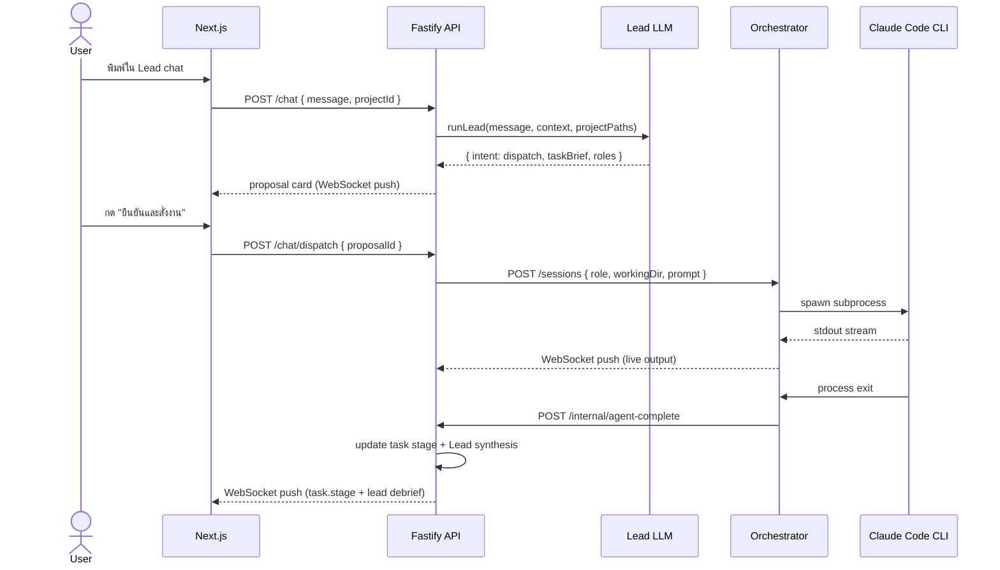

### Agent Dispatch with CLI Provider + Repo Worktree

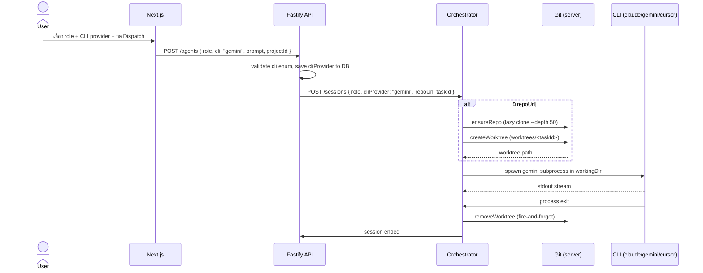

### Review → Fix Loop

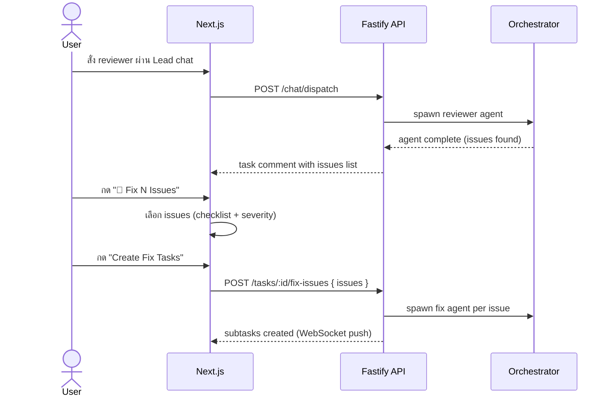

### Local Execution Flow

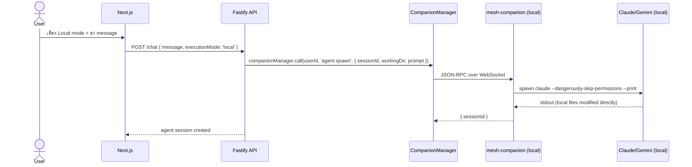

### Authentication Flow

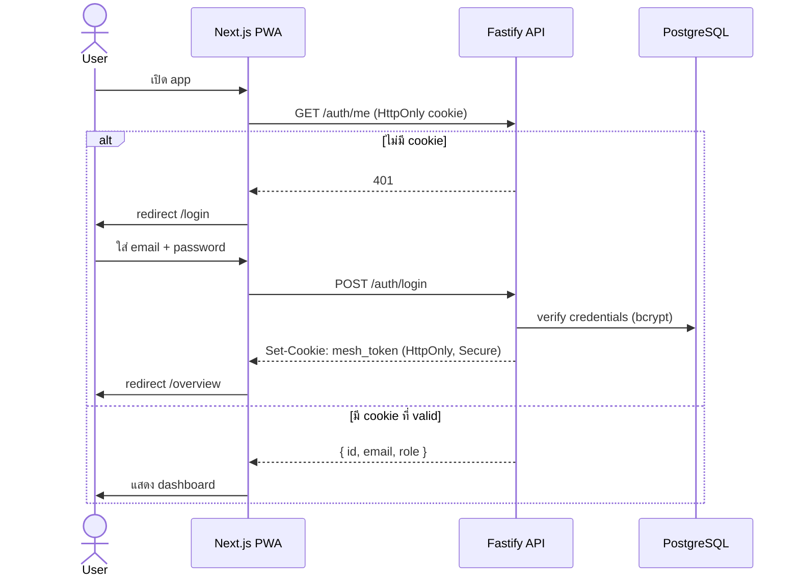

---

## Roadmap

- **v1** — Server-based platform ✅
- **v2** — Local Companion: agents รันบน local machine ผ่าน WebSocket tunnel ✅

---

### Phase 1 — Quality of Life

> เป้าหมาย: จาก "นั่งรอดูหน้าจอ" เป็น "สั่งแล้วไปทำอย่างอื่นได้"

|     | Feature                    | รายละเอียด                                                                 |
| --- | -------------------------- | -------------------------------------------------------------------------- |
| 🔔  | **Notifications**          | LINE / Slack / email แจ้งเตือนเมื่อ agent เสร็จหรือต้องการ input           |
| ⚡  | **Local stdout streaming** | WebSocket push แทน polling ทุก 3 วินาที — output ไหลต่อเนื่องแบบ real-time |
| 📋  | **Task templates**         | บันทึก task ที่ใช้บ่อยเป็น template กด 1 ครั้งสั่งได้เลย                   |

---

### Phase 2 — Power Features

> เป้าหมาย: agents ทำงานได้ฉลาดขึ้นและ integrate กับ workflow ที่มีอยู่

|     | Feature               | รายละเอียด                                                                           |
| --- | --------------------- | ------------------------------------------------------------------------------------ |
| 🧠  | **Agent memory**      | inject project context + task history ให้ agent — ไม่ต้องอธิบาย codebase ซ้ำทุกครั้ง |
| 🗂️  | **Agent queue**       | งานรอ queue อัตโนมัติเมื่อ session เต็ม dispatch ต่อเมื่อมี slot ว่าง                |
| 🔗  | **External triggers** | webhook และ Slack command สำหรับ dispatch agent จาก workflow ภายนอก                  |

---

### Phase 3 — Scale & Analytics

> เป้าหมาย: รองรับทีมขนาดใหญ่ วัดผลได้ ขยาย org ได้

|     | Feature            | รายละเอียด                                                                  |
| --- | ------------------ | --------------------------------------------------------------------------- |
| 💰  | **Cost tracking**  | token usage และ cost per task / per user — รู้ว่าจ่ายเงินไปกับอะไร          |
| 📊  | **Team analytics** | success rate, avg duration, bottleneck analysis — ปรับ workflow ได้แม่นขึ้น |
| 🏢  | **Multi-org**      | isolate users และ projects per organization — รองรับหลาย team หรือ B2B      |
